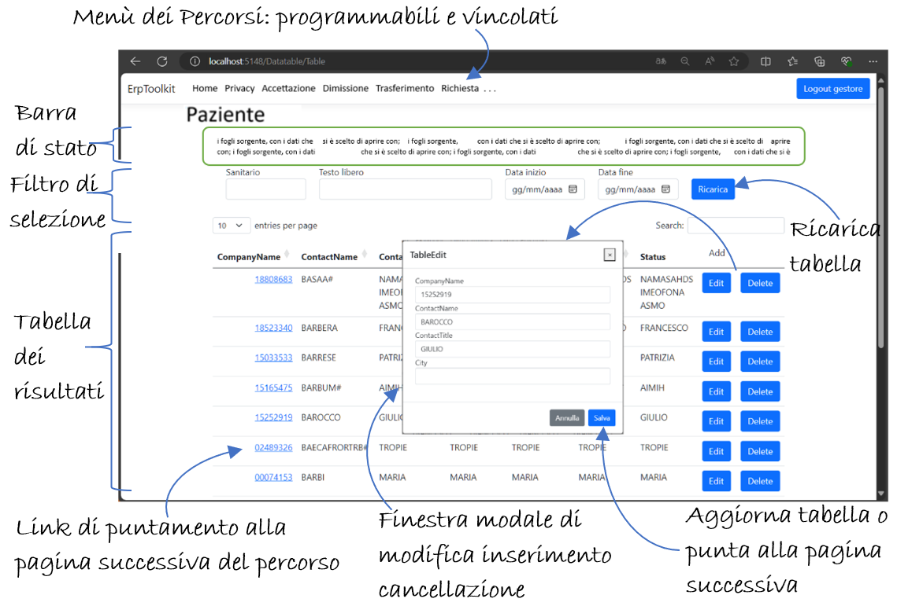
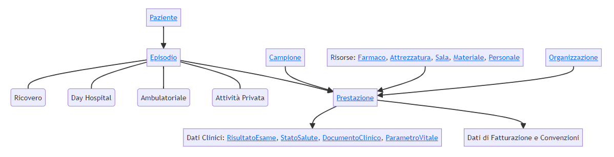

# HealthDemo

L'obiettivo del progetto è costruire una piattaforma di supporto per la creazione, gestione e monitoraggio di semplici ERP (Enterprise Resource Planning). Il progetto di test **HealthDemo** sfruttala la libreria NuGet [**ErpToolkit**](../ErpToolkit/) per le componenti di:

1. **Server Web** (ASP.NET Core 8) per la visualizzazione dell'interfaccia grafica;
2. **Scheduler programmabile** per l'esecuzione temporizzata di attività;
3. **Listener** per l'esposizione di servizi SOAP, REST, ecc.;

e le seguenti funzionalità comuni:

1. `COMP`: Componenti grafici comuni (Autocomplete, Calendario, Tabella, ecc.);
2. `DB`: Moduli di accesso ao DB (SQL Server, ORACLE, IRIS, MongoDB, PostgreSQL, ecc.);
3. `DOG`: Funzionalità di Middleware transazionale.
4. `BO`: Business Objects per la gestione di transazioni complesse.
5. `ENV`: Sistema di autenticazione e profilazione utente, con gestione delle variabili di sessione.


La logica di programmazione del progetto **HealthDemo** risiede nei file:

- `Model`: struttura dati e proprietà dei campi del modello,
- `Controller`: accesso alla base di dati ed elaborazioni funzionali,
- `View`: usato esclusivamente per formalizzare la disposizione grafica dei componenti nella pagina.

che usano la libreria **ErpToolkit** per implementare il progetto specifico.  


# Storyboard

Per ogni oggetto del modello si prevede una vista standard composta da:

1. Una o più **barre di stato** contenenti una sintesi delle proprietà già selezionate con cui si chiama la pagina (es: paziente, episodio, richiesta, ecc.).
2. Un **filtro di selezione** che consente di raffinare la ricerca in base all'impostazione di parametri.
3. Una **tabella** contenente i record selezionati in base al profilo di accesso, alle proprietà di chiamata della pagina e alle proprietà impostate nel filtro.
4. Per ogni riga sono previste **finestre modali di visualizzazione, aggiornamento e cancellazione** del contenuto informativo.
5. Le celle della tabella possono contenere **link** che consentono di proseguire nel percorso o di aprire una nuova finestra di dettaglio.
6. Il pulsante "Add" in testa alla tabella consente di aggiungere un nuovo record alla tabella.



Il menù della form consente di accedere direttamente a una vista del modello, o di programmare un **percorso** logico tra le viste; aggiungendo di volta in volta nuovi parametri di selezione da applicare alle form successive. <br>
Ogni percorso può prevedere **vincoli** programmabili che impediscono di finalizzare l'obiettivo se mancano alcune informazioni necessarie.<br>
Le stesse form possono essere incluse in diversi percorsi, con diversi vincoli di percorribilità e diversi parametri di ingresso.<br> 
Si può prevedere l'uso di **form più complesse** che operano contemporaneamente su diversi oggetti, appoggiandosi eventualmente alle funzionalità di un Business Object.


###  Model

Attributi usati a corredo di una proprietà del Model

```c#
public class Attivita {
	[Display(Name = "Id Gruppo", ShortName="", Description = "Codice dell'attività di cui questa è una sotto-attività", Prompt="")]
	[ErpDogField("AV_ID_GRUPPO", SqlFieldNameExt="AV_ID_GRUPPO", SqlFieldProperties="prop() xref(ATTIVITA.AV__ICODE) xdup() multbxref()")]
	[DefaultValue("")]
	[AutocompleteClient("Attivita", "AutocompleteGetAll", 1)]
	[DataType(DataType.Text)]
	public string? AvIdGruppo  { get; set; }
	public ErpToolkit.Models.SIO.Act.Attivita? AvIdGruppoObj  { get; set; }
}
```
**Display**: contiene il testo da visualizzare nelle _label_.<br>
**ErpDogField**: contiene i riferimenti ai campi del DB.<br>
**AutocompleteClient**: indica che in visualizzazione la textbox avrà funzionalità di _autocomplete_ acquisendo i valori dal controller _AttivitaController_.<br>

###  Controller

Funzioni condivise dal Controller

```c#
    public class AttivitaController : ControllerErp
    {

        ...

        [HttpGet]
        public JsonResult AutocompleteGetAll()
        {
            try
            {
                string sql = "select AV_CODICE + ' - ' + AV_DESCRIZIONE as label, AV__ICODE as value from ATTIVITA where AV__DELETED='N' ";
                return Json(DogHelper.ExecQuery<Choice>(DbConnectionString, sql));
            }
            catch (Exception ex) { return Json(new { error = "Problemi in accesso al DB: AutocompleteGetAll Attivita: " + ex.Message }); }
        }
        [HttpGet]
        public JsonResult AutocompleteGetSelect(string term)
        {
            try
            {
                string sql = "select AV_CODICE + ' - ' + AV_DESCRIZIONE as label, AV__ICODE as value from ATTIVITA where AV__DELETED='N' and upper(AV_CODICE + ' - ' + AV_DESCRIZIONE) like '%" + term.ToUpper() + "%'";
                return Json(DogHelper.ExecQuery<Choice>(DbConnectionString, sql));
            }
            catch (Exception ex)  { return Json(new { error = "Problemi in accesso al DB: AutocompleteGetSelect Attivita: " + ex.Message }); }
        }
        [HttpPost]
        public JsonResult AutocompletePreLoad([FromBody] List<string> values)
        {
            try
            {
                string sql = "select AV_CODICE + ' - ' + AV_DESCRIZIONE as label, AV__ICODE as value from ATTIVITA where AV__DELETED='N' and AV__ICODE in ('" + string.Join("', '", values.ToArray()) + "')";
                return Json(DogHelper.ExecQuery<Choice>(DbConnectionString, sql));
            }
            catch (Exception ex) { return Json(new { error = "Problemi in accesso al DB: AutocompletePreLoad Attivita: " + ex.Message }); }
        }

        ...

        [Authorize(AuthenticationSchemes = "Cookies")]
        [HttpGet]
        public IActionResult Index(string returnUrl = null)
        {
            //carico eventuali parametri presenti in TempData
            foreach (var item in TempData.Keys) ViewData[item] = TempData[item];
            return View("~/Views/SIO/Act/Attivita/Index.cshtml", this);  //passo il Controller alla vista, come Model
        }

        [Authorize(AuthenticationSchemes = "Cookies")]
        [ValidateAntiForgeryToken]
        [HttpPost]
        public ActionResult Index()
        {
            return View("~/Views/SIO/Act/Attivita/Index.cshtml", this);
        }

        ...

    }
```

**AutocompleteGetAll**, **AutocompleteGetSelect** e **AutocompletePreLoad**: sono funzioni a supporto del _**Componente Autocomplete**_ con valori in _Attivita_.<br>
L'attrbuto **Authorize** indica che la pagina può essere visualizzata solo se è stata effettuata la _Login_.<br>

###  View

Tag usati nel View e per visualizzare una proprietà del model. 

```html
@model Attivita
@{
    ViewData["Title"] = "Attivita Edit";
}
<div class="modal-dialog" role="document">
                <div class="form-group">
                    <label asp-for="AvIdGruppo" class="control-label"></label>
                    <input asp-for="AvIdGruppo" class="form-control" />
                    <span asp-validation-for="AvIdGruppo" class="text-danger"></span>
                </div>
</div>
```

Il formato grafico è deciso nel Model. Nel View si dispongono semplicemente i tag nella pagina. 


# Architettura

Consideriamo il modello dati di un **ERP sanitario**, di cui proponiamo una semplice rappresentazione a puro titolo esemplificativo.




- Al centro del processo è presente il `paziente`, che viene anagrafato e contestualizzato nel territorio. 
	- Ogni suo contatto con la struttura ospedaliera genera un `episodio`, che può caratterizzarsi in **ricovero**, **day hospital**, **ambulatoriale** o in **attività privata**. 
		- Nel corso dell'episodio, per il paziente vengono effettuate un certo numero di `prestazioni`, eventualmente raggruppate in una `richiesta`. 
		- L'esecuzione di una prestazione può prevedere il prelievo di un `campione` e l'uso di diverse `risorse`, quali: `materiali`, `farmaci`, `personale sanitario`, `sale operatorie`, ecc. 
		- Durante il ciclo di esecuzione della prestazione il paziente è gestito da diversi `utenti` (**amministrativi**, **sanitari**, **infermieristici**) ed è alternativamente sotto la responsabilità di diverse `unità di cura` (**centri di prenotazione**, **reparti**, **centri di erogazione prestazione**, ecc.), che fanno tutti parte dell'`organizzazione` ospedaliera. 
			- L'esecuzione di una prestazione produce dei `dati clinici`, tra cui: `parametri vitali`, `risultati di esami`, `documenti clinici`, ecc., che vanno archiviati e distribuiti. 
			- L'erogazione del servizio prevede una **gestione di cassa** (contabile) per la **fatturazione** delle prestazioni ed i rimborsi regionali. 
			- L'uso delle risorse prevede una **gestione di magazzino ed amministrativa** del personale.

## Business Objects ERP sanitario

Per questo esempio sono previsti due BO:

- `ADT` - flusso di Accettazione, Dimissione, Trasferimento paziente.
- `Ciclo Atto` - flusso di richiesta-erogazione di una prestazione.

## Percorsi ERP sanitario

- `Inserimento in Lista d'attesa`: ListaPaziente + Inserimento in lista d'attesa.
- `Accettazione`: ListaPaziente + Recupero Lista d'attesa + Accettazione e assegnazione letto.
- `Dimissione`: ListaPaziente + ListaEpisodio + Dimissione e compilazione SDO.
- `Trasferimento`: ListaPaziente + ListaEpisodio + Trasferimento.
- `Richiesta`: ListaPaziente + ListaEpisodio + Inserimento Richiesta.

# Licenza

Questo progetto è distribuito sotto la licenza AGPL-3.0. Vedi il file `LICENSE` per maggiori dettagli.


