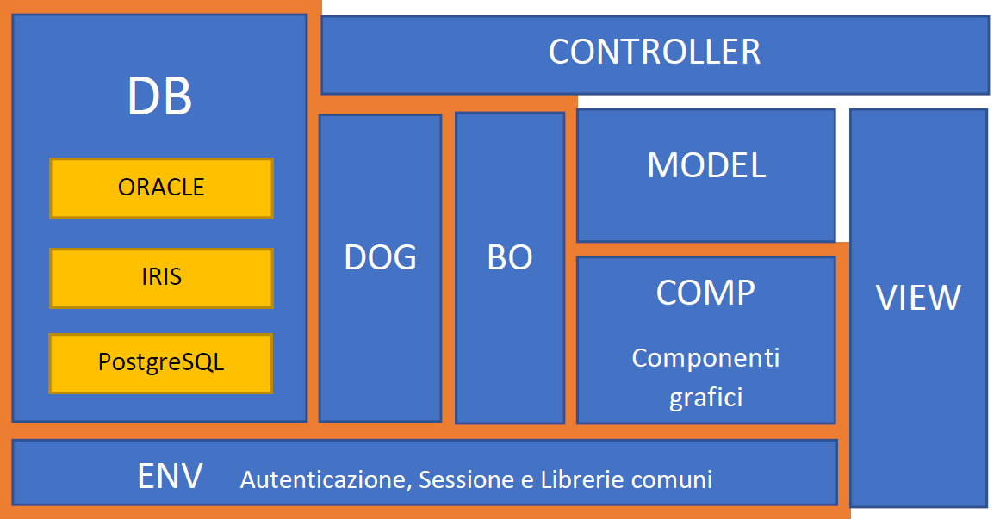

# ErpToolkitSuite

L'obiettivo del progetto è costruire una piattaforma di supporto per la creazione, gestione e monitoraggio di semplici ERP (Enterprise Resource Planning). 
La Suite si compone da una libreria NuGet **ErpToolkit** che contiene le funzionalità core, da un progetto Listener **HealthDemo** dimostrativo di un Erp Sanitario e da un progetto Scheduler **PublisherDemo** dimostrativo di un allineatore tra DB. 

# ErpToolkit

Modulo Core con funzionalità di Listener e Scheduler.
La struttura del software si compone di:

1. **Server Web** (ASP.NET Core 8) per la visualizzazione dell'interfaccia grafica basata su architettura MVC (Model-View-Controller), che separa logicamente struttura, visualizzazione e gestione dei dati.
2. **Scheduler programmabile** per l'esecuzione temporizzata di attività.
3. **Listener** per l'esposizione di servizi SOAP, REST, ecc.

I tre moduli condividono una libreria di utilities che espone le seguenti funzionalità.

- `COMP`: Componenti grafici per facilitare la creazione delle pagine web: Autocomplete, Calendario, Tabella, ecc.
- `DB`: Moduli di accesso a diversi database e normalizzazione dei dati: SQL Server, ORACLE, IRIS, MongoDB, PostgreSQL, ecc.
- `DOG`: Funzionalità di archiviazione controllata dei dati per la generazione dei contatori, la gestione delle transazioni, l'audit delle attività e i processi di allineamento asincrono da DB.
- `BO`: Business Objects per la verifica dei dati e la governance delle transazioni complesse su DB.
- `ENV`: Sistema di autenticazione e profilazione utente, con gestione delle variabili di sessione.

La logica di programmazione dei singoli progetto (es: HealthDemo, PublisherDemo, ecc.) risiede invece nei file:

- `Model`: struttura dati e proprietà dei campi del modello,
- `Controller`: accesso alla base di dati ed elaborazioni funzionali,
- `View`: usato esclusivamente per formalizzare la disposizione grafica dei componenti nella pagina.

che usano la libreria **ErpToolkit** per implementare il progetto specifico.  




Il modello tecnologico prevede l'uso di un servizio Windows o di un processo in background Linux con scalabilità su più macchine in load-balancing, collaborazione tra i processi e monitoraggio centralizzato.

Ognuna delle seguenti parti dell'architettura MVC può sfruttare le funzionalità esposte dalla libreria comune per facilitare lo sviluppo di interfacce e/o allineatori. 
E' necessario descrivere il modello usando specifici attributi riconosciuti dalla libreria (es: `[AutocompleteClient("Attivita", "AutocompleteGetAll", 1)]`).
Gli attributi fanno riferimento a funzionalità programmate nelle classi del controller (es: `public JsonResult AutocompleteGetAll()`).
La classe Views serve a collocare nella pagina il controllo (es: `<input asp-for="AvIdGruppo" class="form-control" />`).
Le proprietà del modello consentono anche alla libreria di acquisire le relazini tra i vari campi delle tabelle, per l'impementazione di funzioni di pubblicazione e/o la realizzazione di componenti specifici (es: `[ErpDogField("AV_ID_GRUPPO", SqlFieldNameExt="AV_ID_GRUPPO",  ...  xref(ATTIVITA.AV__ICODE)")]`).

## Model

Attributi usati a corredo di una proprietà del Model

```c#
public class Attivita {
	[Display(Name = "Id Gruppo", ShortName="", Description = "Codice dell'attività di cui questa è una sotto-attività", Prompt="")]
	[ErpDogField("AV_ID_GRUPPO", SqlFieldNameExt="AV_ID_GRUPPO", SqlFieldProperties="prop() xref(ATTIVITA.AV__ICODE) xdup() multbxref()")]
	[DefaultValue("")]
	[AutocompleteClient("Attivita", "AutocompleteGetAll", 1)]
	[DataType(DataType.Text)]
	public string? AvIdGruppo  { get; set; }
	public ErpToolkit.Models.SIO.Act.Attivita? AvIdGruppoObj  { get; set; }
}
```
**Display**: contiene il testo da visualizzare nelle _label_.<br>
**ErpDogField**: contiene i riferimenti ai campi del DB.<br>
**AutocompleteClient**: indica che in visualizzazione la textbox avrà funzionalità di _autocomplete_ acquisendo i valori dal controller _AttivitaController_.<br>

## Controller

Funzioni condivise dal Controller

```c#
    public class AttivitaController : ControllerErp
    {

        ...

        [HttpGet]
        public JsonResult AutocompleteGetAll()
        {
            try
            {
                string sql = "select AV_CODICE + ' - ' + AV_DESCRIZIONE as label, AV__ICODE as value from ATTIVITA where AV__DELETED='N' ";
                return Json(DogHelper.ExecQuery<Choice>(DbConnectionString, sql));
            }
            catch (Exception ex) { return Json(new { error = "Problemi in accesso al DB: AutocompleteGetAll Attivita: " + ex.Message }); }
        }
        [HttpGet]
        public JsonResult AutocompleteGetSelect(string term)
        {
            try
            {
                string sql = "select AV_CODICE + ' - ' + AV_DESCRIZIONE as label, AV__ICODE as value from ATTIVITA where AV__DELETED='N' and upper(AV_CODICE + ' - ' + AV_DESCRIZIONE) like '%" + term.ToUpper() + "%'";
                return Json(DogHelper.ExecQuery<Choice>(DbConnectionString, sql));
            }
            catch (Exception ex)  { return Json(new { error = "Problemi in accesso al DB: AutocompleteGetSelect Attivita: " + ex.Message }); }
        }
        [HttpPost]
        public JsonResult AutocompletePreLoad([FromBody] List<string> values)
        {
            try
            {
                string sql = "select AV_CODICE + ' - ' + AV_DESCRIZIONE as label, AV__ICODE as value from ATTIVITA where AV__DELETED='N' and AV__ICODE in ('" + string.Join("', '", values.ToArray()) + "')";
                return Json(DogHelper.ExecQuery<Choice>(DbConnectionString, sql));
            }
            catch (Exception ex) { return Json(new { error = "Problemi in accesso al DB: AutocompletePreLoad Attivita: " + ex.Message }); }
        }

        ...

        [Authorize(AuthenticationSchemes = "Cookies")]
        [HttpGet]
        public IActionResult Index(string returnUrl = null)
        {
            //carico eventuali parametri presenti in TempData
            foreach (var item in TempData.Keys) ViewData[item] = TempData[item];
            return View("~/Views/SIO/Act/Attivita/Index.cshtml", this);  //passo il Controller alla vista, come Model
        }

        [Authorize(AuthenticationSchemes = "Cookies")]
        [ValidateAntiForgeryToken]
        [HttpPost]
        public ActionResult Index()
        {
            return View("~/Views/SIO/Act/Attivita/Index.cshtml", this);
        }

        ...

    }
```

**AutocompleteGetAll**, **AutocompleteGetSelect** e **AutocompletePreLoad**: sono funzioni a supporto del _**Componente Autocomplete**_ con valori in _Attivita_.<br>
L'attrbuto **Authorize** indica che la pagina può essere visualizzata solo se è stata effettuata la _Login_.<br>

## View

Tag usati nel View e per visualizzare una proprietà del model. 

```html
@model Attivita
@{
    ViewData["Title"] = "Attivita Edit";
}
<div class="modal-dialog" role="document">
                <div class="form-group">
                    <label asp-for="AvIdGruppo" class="control-label"></label>
                    <input asp-for="AvIdGruppo" class="form-control" />
                    <span asp-validation-for="AvIdGruppo" class="text-danger"></span>
                </div>
</div>
```

Il formato grafico è deciso nel Model. Nel View si dispongono semplicemente i tag nella pagina. 


# Use Case

Come Use Case consideriamo, 
- [**HealthDemo**](./HealthDemo/): il modello dati di un ERP sanitario, di cui proponiamo una semplice rappresentazione a puro titolo esemplificativo.
- **PublisherDemo**: un semplice allineatore tra DB che, tenendo conto dell'integrità referenziale del modello, trasferisce anche i record relazionati. 


# Librerie esterne usate


- `DataTables`: Add advanced interaction controls to your HTML tables [https://datatables.net/].
- `Mermaid`: Diagramming and charting tool [https://mermaid.js.org/].
- `Quill`: Your powerful rich text editor [https://quilljs.com/].


# Installazione

. . . 

# Utilizzo

. . . 

# Licenza

Questo progetto è distribuito sotto la licenza AGPL-3.0. Vedi il file `LICENSE` per maggiori dettagli.


